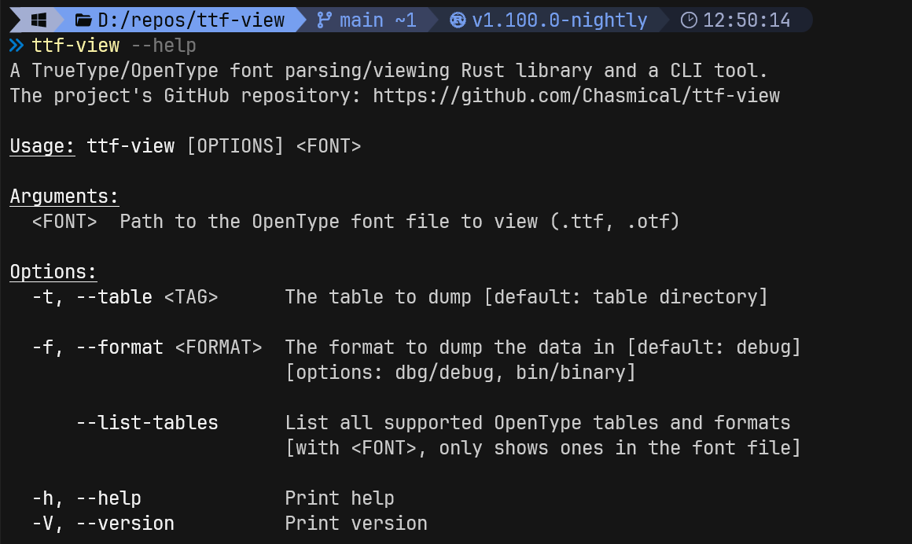
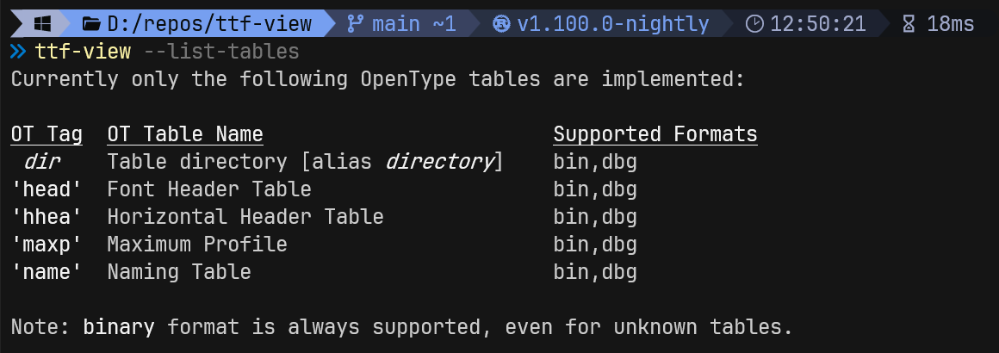
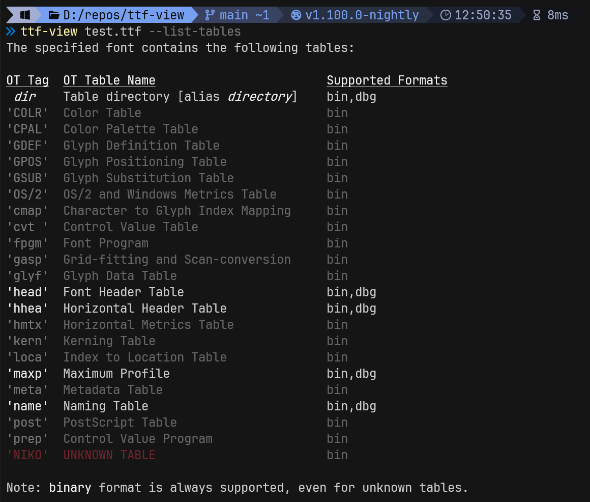
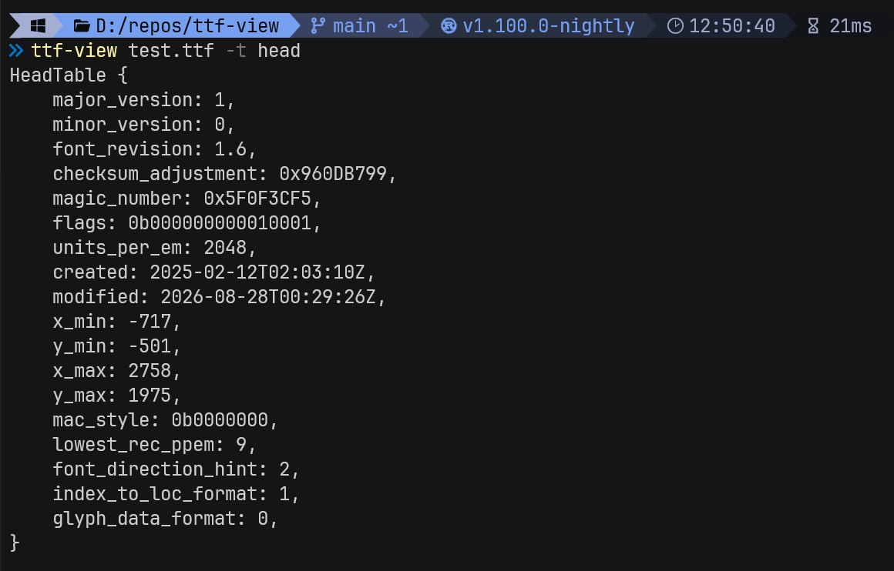

# ttf-view

A TrueType/OpenType font parsing/viewing library and a CLI tool.

For information about the Rust library, go to [its docs.rs documentation](https://docs.rs/ttf-view/).

## Installation

```sh
cargo +nightly-2026-09-04 install ttf-view -F cli
```

You can also find an already compiled exe for Windows x86_64 in [Releases](https://github.com/Chasmical/ttf-view/releases/latest).

## Usage examples









## License

Licensed under either [Apache License, Version 2.0](LICENSE-APACHE) or [MIT license](LICENSE-MIT) at your option.

## Contribution

Unless you explicitly state otherwise, any contribution intentionally submitted
for inclusion in the work by you, as defined in the Apache-2.0 license, shall be
dual licensed as above, without any additional terms or conditions.
